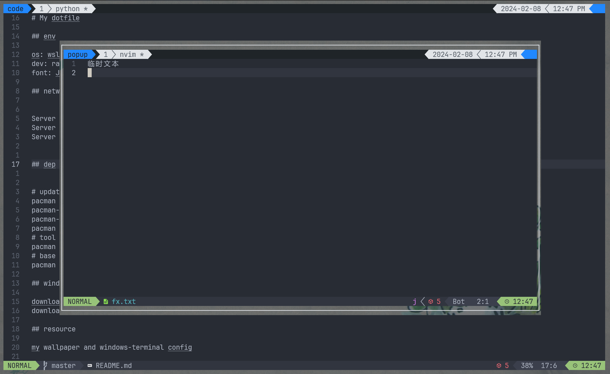

# My dotfile

## 

## env

os: wsl + arch<br>
dev: ranger + lazyvim + lazygit<br>
font: [JetBrainsMono](https://www.nerdfonts.com/font-downloads)

## network etc

```shell
Server = https://mirrors.tuna.tsinghua.edu.cn/archlinux/$repo/os/$arch
Server = https://mirrors.ustc.edu.cn/archlinux/$repo/os/$arch
Server = https://mirrors.huaweicloud.com/archlinux/$repo/os/$arch
```

## dep

```shell
# update arch key
pacman -Syyu
pacman-key --init
pacman-key --populate
pacman -Syy archlinux-keyring
# tool
pacman -S lazygit neovim tmux git-delta zsh npm zip unzip fastfetch bat eza
# base dev
pacman -S base-devel openssh

#macos
# macos dep
brew install yazi ffmpeg sevenzip jq poppler fd ripgrep fzf zoxide imagemagick font-symbols-only-nerd-font
# ocr 
brew install tesseract
# macos wm
brew tap FelixKratz/formulae
brew install sketchybar
brew install --cask font-hack-nerd-font
brew install --cask raycast
brew install --cask nikitabobko/tap/aerospace

brew tap FelixKratz/formulae
brew install borders
# macos software and font
brew install --cask font-jetbrains-mono-nerd-font font-victor-mono kitty wezterm sublime-text visual-studio-code free-ruler flameshot notion neteasemusic wechat qq google-chrome anki
```
## windows register

download [windows](https://github.com/massgravel/Microsoft-Activation-Scripts) version<br>
download [wsl-vpn](https://github.com/sakai135/wsl-vpnkit)

## resource

my wallpaper and windows-terminal config

## tip
I have a mklinks zsh to move dotfile<br>
### search text
```shell
grep -rh '<el-'|awk -F el- '{print $2}'|awk -F ' ' '{print$1}'|sort|uniq
```
